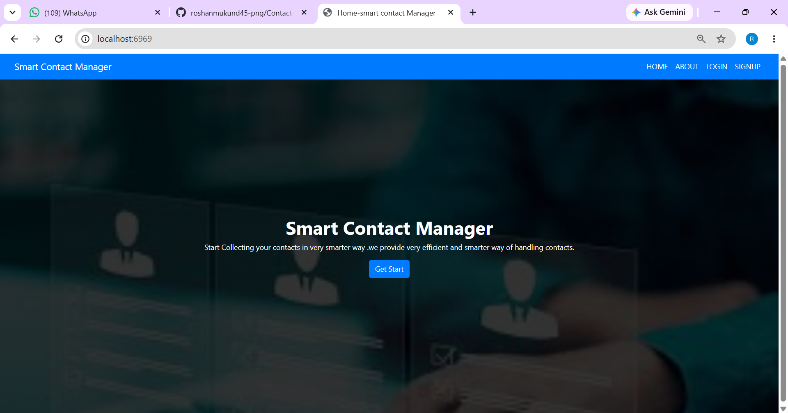
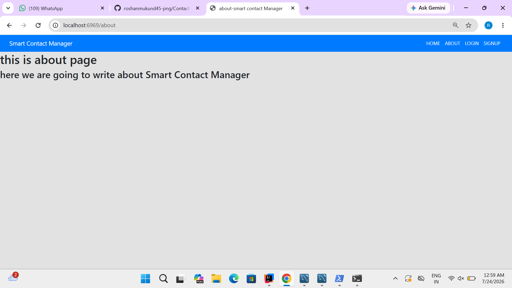
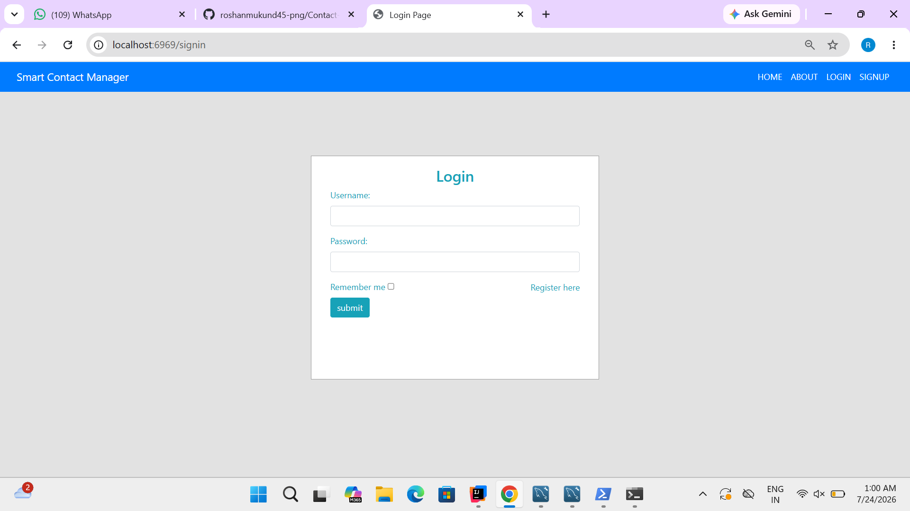
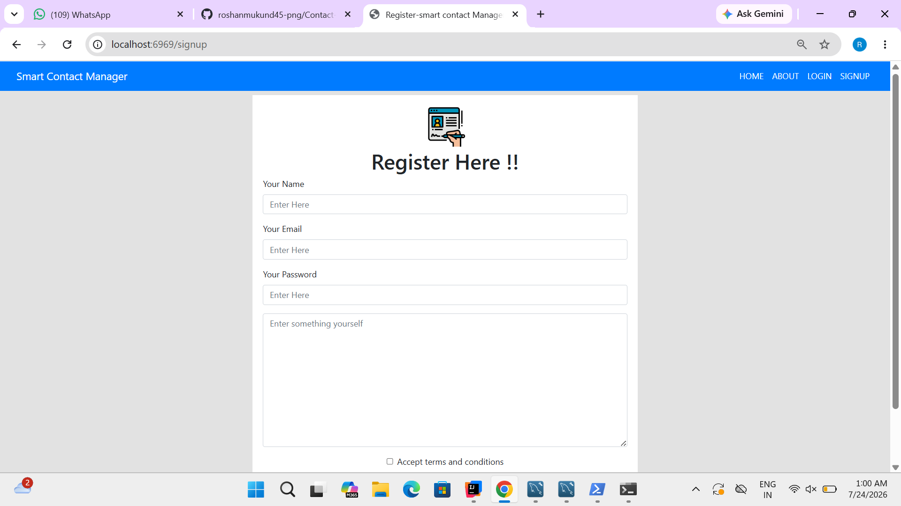

# Contact-Management-System
A full-stack Contact Management System built using Java, Spring Boot, Thymeleaf, MySQL, Spring Security, HTML, CSS, and JavaScript. It includes user authentication, CRUD operations, role-based access control, and a responsive UI.
## Screenshots

### Home Page

### About Page

### Login Page

### Signup Page

